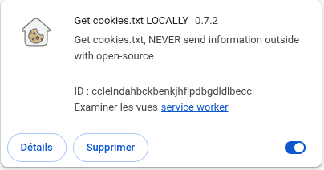

# Underground CRM

Underground CRM is an open-source Django library that gives political movements
three core capabilities:

- **CRM** — a database of people and a full record of your ongoing relationship
  with each of them
- **CMS** — Wagtail-powered page editing for your organisers
- **Bulk email** — SMPT2Go integration for member communications

Migration tooling is included to help you move from a previous CRM.

## Architecture

Underground CRM is not quite a standalone project − it is intended to be extended (by you)
with the creation of a **theme project** that installs the library and provides
a site name, branding templates, and any organisation-specific page models.

The sibling repo `fusion-underground` is the reference theme for the Fusion
Party and is the easiest way to see a working deployment.

Once your theme is implemented, notice here the file [start-containers.sh](./start_containers.sh)
which starts the accompanying services for running this application.

## Infrastructure requirements

The `docker-compose.yml` in this repo runs Redis, OpenSearch, and
[Addressr](https://addressr.io) for address autocomplete. Addressr's data
loader holds each state's geocoding data in memory while indexing; New South
Wales alone has 5 million addresses. The loader crashes with Node.js's default
heap limit, so `docker-compose.yml` sets `NODE_OPTIONS=--max-old-space-size=8192`
to give it an 8 GB heap. Allow additional RAM for OpenSearch and the OS on top
of that.

## Setting up and running a theme project

```bash
mkdir my-theme && cd my-theme
python -m venv .venv && source .venv/bin/activate
pip install underground-crm
django-admin startproject my_site .
```

In `my_site/settings.py`, replace the generated contents with:

```python
import os
from pathlib import Path
from underground_crm.settings import *  # noqa: F401, F403

BASE_DIR = Path(__file__).resolve().parent.parent

SECRET_KEY = os.environ.get("DJANGO_SECRET_KEY", "change-me")
DEBUG = os.environ.get("DJANGO_DEBUG", "true").lower() == "true"
ALLOWED_HOSTS = os.environ.get("DJANGO_ALLOWED_HOSTS", "localhost 127.0.0.1").split()

INSTALLED_APPS = ["my_app"] + INSTALLED_APPS  # noqa: F405

WSGI_APPLICATION = "my_site.wsgi.application"

STATIC_ROOT = BASE_DIR / "static"
MEDIA_ROOT = BASE_DIR / "media"

WAGTAIL_SITE_NAME = "My Organisation"
```

The base settings supply everything else: installed apps, middleware, URL
routing, auth model, database config (via `PG*` env vars), Wagtail, and
timezone. See `underground_crm/settings.py` for the full list.

Then apply migrations and create a superuser:

```shell
python manage.py migrate
python manage.py createsuperuser
python manage.py runserver
```

In a second terminal, run the queue cluster:
```shell
python manage.py qcluster
```

In a third terminal, run the associated Docker containers:
```shell
./start_containers.sh
```

Your theme might require you to run further applications to load the full website functionality. 

Visit one of these pages:
- Django admin: `/django-admin/`
- Wagtail CMS: `/cms/`
- Login: `/account/login/`

---

## Static site generation

Underground CRM includes [Wagtail Bakery](https://github.com/wagtail-nest/wagtail-bakery),
which can render all published Wagtail pages to static HTML files and optionally
upload them to an object store (e.g. Amazon S3).

To build the static site into the `BUILD_DIR` directory:

```bash
python manage.py build
```

The default `BAKERY_VIEWS` setting bakes every published Wagtail page. To exclude pages
that require a live backend (e.g. payment pages, form submissions), override
`BAKERY_VIEWS` in your theme's settings to point at a custom subclass of
`AllPublishedPagesView`:

```python
# my_theme/bakery_views.py
from wagtailbakery.views import AllPublishedPagesView
from my_app.models import CheckoutPage

class AllPublishedPagesExcludingCheckout(AllPublishedPagesView):
    def get_queryset(self):
        return super().get_queryset().not_type(CheckoutPage)
```

```python
# my_site/settings.py
BAKERY_VIEWS = ("my_app.bakery_views.AllPublishedPagesExcludingCheckout",)
BUILD_DIR = BASE_DIR / "build"
```

Note that the default Django login / logout / signup pages are not Wagtail pages and hence
will not be baked. This is just as well, as they aren't suitable for static rendering.

### User-dependent components

Baked pages are "static" HTML — a version of the page that was already rendered
for users to see before we ever knew who the user was. No request reaches the Django
web application, so that means no authentication is checked and no database queries
are executed at the time of the request.

Any part of your UI that depends on the
current user (login state, member-specific content, personalised data) will not
work in a baked page, so you should either [exclude those from the "baking" of 
Wagtail-bakery](https://github.com/wagtail-nest/wagtail-bakery/), or **_your theme_** will need to figure out how to handle such components:

* Maybe a user can fill out a form and include all their signup information all 
  over again, in case they weren't already registered.
* Maybe you can use jQuery to fetch things (at API endpoints) after the page loads.

---

## Data migration

If you are migrating people and activity records from a previous CRM, fill
in the `LEGACY_*` environment variables in your `.env`:

| Variable | Description |
|---|---|
| `LEGACY_WEBSITE_URL` | Base URL of the legacy CRM (no trailing slash). |
| `LEGACY_API_URL` | Base URL of the legacy REST API. |
| `LEGACY_API_TOKEN` | Bearer token for the legacy API. |
| `LEGACY_USER_AGENT` | Browser user-agent string for cookie-authenticated requests. |
| `LEGACY_ADMIN_COOKIE_FILE` | Path to a Netscape-format cookie file exported from your browser. |

### Import people from a CSV export

```bash
python manage.py import_people_csv people.csv
```

To also import interactions and private notes from the live legacy CRM during
the same run:

```bash
python manage.py import_people_csv people.csv --with-interactions --with-notes
```

Pass `--dry-run` to preview what would be imported without writing anything.
The command is idempotent — it is safe to run multiple times.

### Import private notes for a single person

```bash
python manage.py import_legacy_private_notes <legacy_person_id>
```

Requires a valid cookie file pointed to by `LEGACY_ADMIN_COOKIE_FILE` (or passed
via `--cookie-file`). The legacy admin session must still be active.

Get the cookie file using e.g. the Chrome extension
[Get cookies.txt LOCALLY](https://chromewebstore.google.com/detail/get-cookiestxt-locally/cclelndahbckbenkjhflpdbgdldlbecc?hl=fr&utm_source=ext_sidebar):



Get the user agent from e.g. <https://whatmyuseragent.com/>

### Standalone fetch scripts

The `migration/` directory contains standalone Python scripts for fetching
data from the legacy CRM and writing newline-delimited JSON to stdout:

```bash
cd migration
python fetch_all_interactions.py          # all interactions
python fetch_all_interactions.py 12345    # one person
python fetch_all_private_notes.py         # all private notes
python fetch_all_private_notes.py 12345   # one person
```

Pipe the output to a file for later import:

```bash
python fetch_all_interactions.py > interactions.ndjson
```

These scripts read their configuration from `../.env` automatically.

### Import CMS pages

Pages are imported in three steps: fetch, parse, then import.

**Step 1 — fetch each page's JSON and HTML from the legacy CRM:**

```bash
cd migration
python manage.py fetch_pages --domain fusionparty.org.au --slug climate_rescue
python manage.py fetch_pages --domain fusionparty.org.au --slug future_focused
```

This creates `<domain>/<slug>.json` (the JSON:API metadata record) and
`<domain>/<slug>.html` (the full rendered HTML) for each slug. Run it once
per page you want to migrate.

**Step 2 — parse the HTML and import into Wagtail:**

```bash
python manage.py import_pages --domain fusionparty.org.au
```

For each `<slug>.html` in the domain directory, the script reads the
corresponding JSON, extracts the element with `id="content"` from the HTML
(writing it to `<domain>/importable/<slug>.html`), then creates the page in
Wagtail. The legacy `page_type_name` is mapped to a Wagtail model
(`"Basic"` → `BasicPage`); unrecognised types are logged as warnings and
skipped.

Run this from your theme project's root directory (where `manage.py` lives),
or set `DJANGO_PROJECT_DIR` to that path in your `.env`. The script also
requires `DJANGO_SETTINGS_MODULE`:

| Variable | Description |
|---|---|
| `DJANGO_SETTINGS_MODULE` | Python dotted path to your theme's settings module (e.g. `fusion_site.settings`). |
| `DJANGO_PROJECT_DIR` | Path to the theme project root, if it is not the working directory. |

If a page with the same slug already exists, pass `--replace` to delete and
recreate it:

```bash
python import_pages.py --domain fusionparty.org.au --replace
```
